# Konfiguration

Alles, was du nach der [Installation](installation.md) im Asset Server einstellst: Zugang für die Satelliten, Namespaces und die Sounds selbst.

## Zugang für die Satelliten einrichten

Der Server ist nach dem Start leer und geschützt: Die Satelliten brauchen ein Token, um
Sounds abzuholen. Das legst du in der Verwaltungs-Oberfläche an:

1. Melde dich an der Verwaltungs-Oberfläche als `admin` an (siehe
   [Installation](installation.md#erster-login)).
2. Wechsle im Admin-Bereich auf den Tab **Service Accounts** und wähle **New**. Als Name
   passt z. B. `satellite-download`. Nach dem Anlegen erscheint der Account in der Liste:

    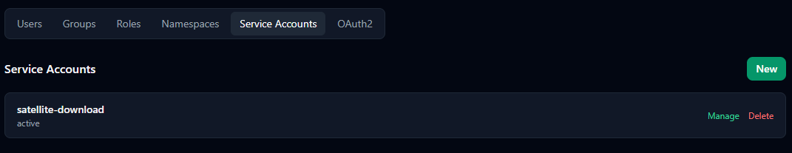

3. Klicke beim neuen Account auf **Manage** und trage im Feld *Permissions* eine Zeile
   `satellite:read` ein. Speichere mit **Save Permissions**.

    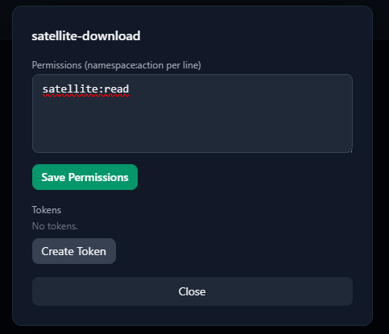

4. Klicke auf **Create Token** und kopiere das Token sofort — es wird nur ein einziges Mal
   angezeigt.

    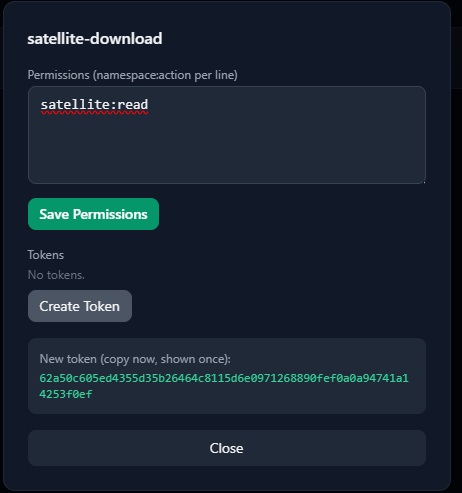

Ein Service Account mit `read` auf `satellite` darf auch alle Assets der übergeordneten
Namespaces lesen (siehe unten).

## Satelliten auf den eigenen Server umstellen

Dazu brauchst du drei Angaben:

| Feld | Wert |
|---|---|
| URL | `http://<IP-des-Docker-Hosts>:8080` (ohne `/` am Ende) |
| Token | das Token aus dem vorherigen Schritt |
| Namespace | leer lassen — der Default ist `satellite` |

Wo du sie einträgst, hängt davon ab, ob der Satellit schon läuft — alle Wege sind in der
[Übersicht](index.md) beschrieben. Hier die passenden Oberflächen dazu:

**Neue Satelliten:** Trage URL und Token im ioBroker-Adapter unter
[Satellite Defaults](../iobroker-adapter/configuration.md#satellite-defaults) ein, **bevor**
du das erste Image erzeugst. Jedes weitere Image übernimmt sie dann automatisch.

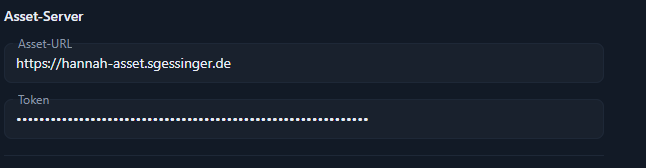

Beim Erzeugen eines Images im Satellite Manager stehen dieselben Felder noch einmal im
Dialog und sind dort vorbelegt — du kannst sie also auch pro Gerät überschreiben:

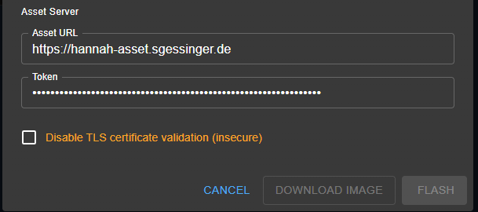

**Laufende Satelliten:** Jeder Satellit hat in seiner eigenen Web-Oberfläche einen
Abschnitt "Asset Server" mit URL, Token und Namespace. Ein Firmware-Neubau ist nicht nötig,
die Werte werden auf dem Satelliten selbst gespeichert.

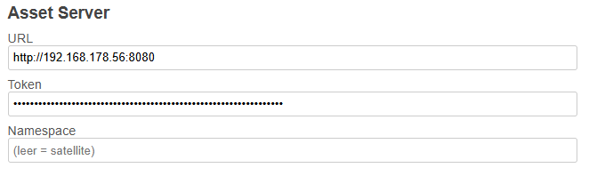

## Namespaces

Assets sind in **Namespaces** organisiert. Es gibt drei von Anfang an: `shared` als
Wurzel, darunter `core` und `satellite`. Sie vererben nach unten:

- Ein Asset in `shared` steht sowohl in `core` als auch in `satellite` zur Verfügung.
- Ein Asset in `satellite` gilt nur für Satelliten, eines in `core` nur für Core.
- Gibt es dasselbe Asset auf mehreren Ebenen, gewinnt die spezifischste — ein `play` in
  `satellite` überschreibt also ein `play` in `shared`.

!!! note "`core` wird aktuell nicht genutzt"
    Der Namespace `core` ist für Assets gedacht, die Hannah Core selbst braucht. Core holt
    derzeit keine Assets vom Asset Server, der Namespace bleibt also leer. Er wird trotzdem
    angelegt, falls Core später wieder Assets bekommt — löschen musst du ihn nicht. Alle
    Sounds, die du brauchst, gehören in `satellite`.

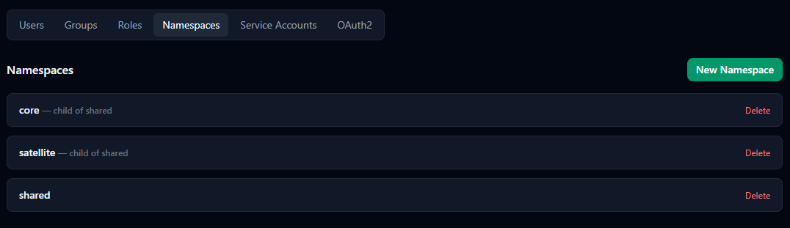

Du kannst weitere Namespaces anlegen, z. B. `satellite-test` als Kind von `satellite`, um
Sounds auf einem einzelnen Satelliten auszuprobieren. Dessen Namespace trägst du dann in der
Web-Oberfläche dieses Satelliten ein.

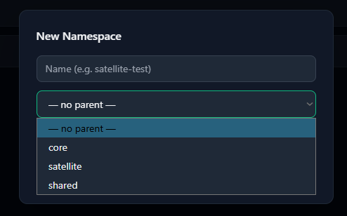

## Sounds einspielen

Ein frisch installierter Server enthält keine Sounds — die Satelliten bleiben stumm, bis
welche da sind. Am schnellsten geht es mit dem Starter-Paket, das die Standard-Sounds der
Satelliten enthält (`alarm_ring`, `connect`, `message_chime` und `timer_jingle`):

[hannah-assets.tar.gz herunterladen](../../assets/download/hannah-assets.tar.gz)

1. Melde dich als `admin` an und öffne den Tab **Assets**. Oben rechts findest du die
   Schaltflächen **Export**, **Import** und **Upload**.

    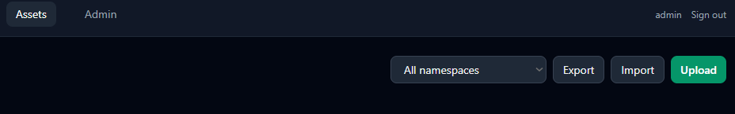

2. Klicke auf **Import**, wähle die heruntergeladene Datei und lass als Ziel **As named in
   the bundle** stehen. Der Namespace `satellite` wird bei Bedarf angelegt.

    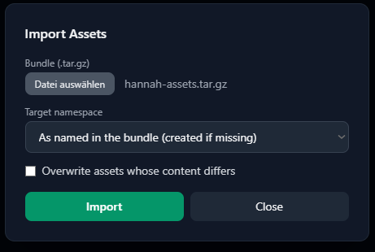

3. Mit **Import** bestätigen. Der Dialog zeigt dir danach, was eingespielt wurde:

    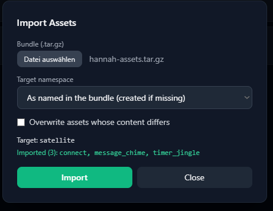

Im Tab **Assets** siehst du die Sounds jetzt, wenn du den Namespace `satellite` auswählst:

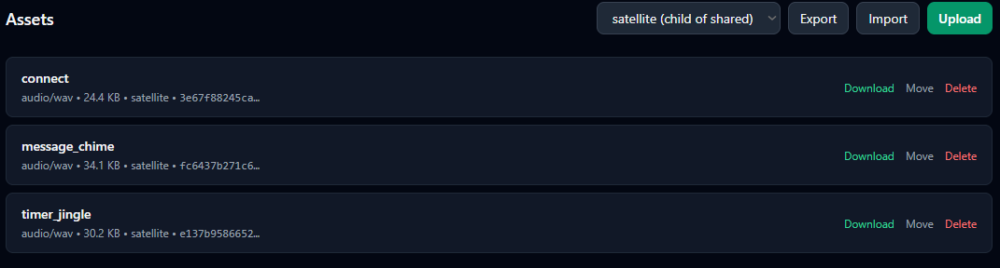

!!! note "Bereits vorhandene Sounds"
    Hast du einen Sound mit demselben Namen schon selbst angelegt, ersetzt der Import ihn nur,
    wenn du **Overwrite assets whose content differs** ankreuzt.

### Eigene Sounds

Eigene Sounds lädst du entweder über **Upload** in der Verwaltungs-Oberfläche hoch oder per
Kommandozeile mit dem im [Quellcode](https://github.com/NurPech/hannah-asset-server)
enthaltenen `scripts/asset-cli.ps1` (PowerShell 7+). Zum Hochladen braucht der Account
`write` auf dem Ziel-Namespace — das ist der `admin`, nicht der Satelliten-Account.

## API

Für eigene Integrationen: die Manifest-/Download-Endpunkte sind unter
[Asset Server (Entwickler)](../../services/asset-server.md) dokumentiert.
