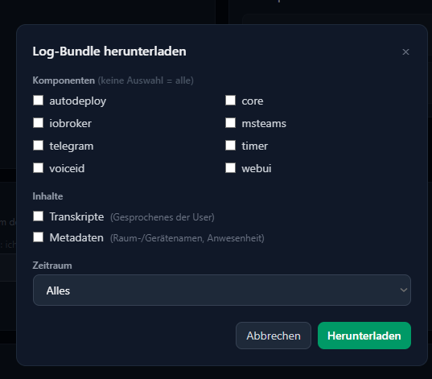

# Logs herunterladen

Wenn etwas nicht so läuft wie erwartet, brauchst du für die Fehlersuche meist die Logs
mehrerer Komponenten auf einmal. Mit dem LogCollector lädst du sie direkt in der WebUI
als ein einziges Archiv herunter — zum Beispiel, um es an eine Fehlermeldung
anzuhängen.

Dafür brauchst du **Trust-Level 10**.

## Wo finde ich das?

Sobald ein LogCollector mit Hannah verbunden ist, erscheint in der oberen Leiste der
WebUI der Eintrag **Logs** — allerdings nur für Nutzer mit Trust-Level 10. Alle anderen
sehen ihn gar nicht, und ohne LogCollector gibt es ihn für niemanden.

## Auswahl

Ein Klick auf **Logs** öffnet ein Fenster, in dem du festlegst, was ins Archiv kommt:

- **Komponenten** — die Komponenten, von denen Logs vorliegen. Wählst du keine aus,
  kommen alle ins Archiv.
- **Inhalte** — zwei Arten von Log-Zeilen sind standardmäßig **nicht** enthalten und
  müssen bei Bedarf ausdrücklich dazugewählt werden:
    - **Transkripte** — was im Haushalt zu Hannah gesagt wurde
    - **Metadaten** — Raum- und Gerätenamen sowie, wer wann zu Hause war
- **Zeitraum** — *Alles*, *Letzte Stunde*, *Letzte 24 Stunden*, *Letzte 7 Tage* oder
  *Benutzerdefiniert*. Beim benutzerdefinierten Zeitraum gibst du Beginn und Ende an;
  bleibt das Ende leer, reicht der Zeitraum bis jetzt.

**Herunterladen** erzeugt ein `.tar.gz`-Archiv: pro Komponente eine Textdatei, dazu eine
Übersicht mit Versionen, Zeitraum und eventuellen Lücken.

!!! tip "Logs öffentlich teilen"
    Willst du das Archiv öffentlich posten, etwa in einem Forum, lass Transkripte und
    Metadaten aus — sie verraten viel über deinen Haushalt. Für die meisten
    Fehlersuchen reichen die Logs auch ohne sie. Passwörter und andere Zugangsdaten
    landen ohnehin nie in den Logs, die filtern die Komponenten vorher heraus.
