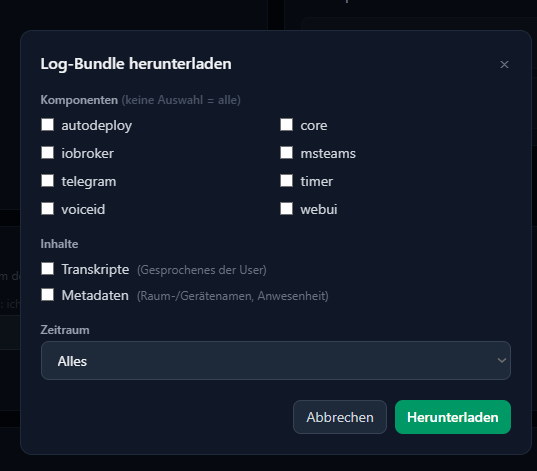

# Logs herunterladen

Wenn etwas nicht so läuft wie erwartet, brauchst du für die Fehlersuche meist die Logs
mehrerer Komponenten auf einmal. Mit dem LogCollector lädst du sie direkt in der WebUI
als ein einziges Archiv herunter — zum Beispiel, um es an eine Fehlermeldung
anzuhängen.

Dafür brauchst du **Trust-Level 10**.

## Wo finde ich das?

Sobald ein LogCollector mit Hannah verbunden ist, erscheint in der oberen Leiste der
WebUI der Eintrag **Logs** — allerdings nur für Nutzer mit Trust-Level 10. Alle anderen
sehen ihn gar nicht, und ohne LogCollector gibt es ihn für niemanden.

## Auswahl

Ein Klick auf **Logs** öffnet ein Fenster, in dem du festlegst, was ins Archiv kommt:

- **Komponenten** — die Komponenten, von denen Logs vorliegen. Wählst du keine aus,
  kommen alle ins Archiv.
- **Inhalte** — zwei Arten von Log-Zeilen sind standardmäßig **nicht** enthalten und
  müssen bei Bedarf ausdrücklich dazugewählt werden:
    - **Transkripte** — was im Haushalt zu Hannah gesagt oder geschrieben wurde, samt
      Hannahs Antworten
    - **Metadaten** — Angaben zu Personen, etwa wer wann zu Hause war oder was sich
      Hannah über jemanden gemerkt hat
- **Zeitraum** — *Alles*, *Letzte Stunde*, *Letzte 24 Stunden*, *Letzte 7 Tage* oder
  *Benutzerdefiniert*. Beim benutzerdefinierten Zeitraum gibst du Beginn und Ende an;
  bleibt das Ende leer, reicht der Zeitraum bis jetzt.

**Herunterladen** erzeugt ein `.tar.gz`-Archiv: pro Komponente eine Textdatei, dazu eine
Übersicht mit Versionen, Zeitraum und eventuellen Lücken.

!!! tip "Logs öffentlich teilen"
    Willst du das Archiv öffentlich posten, etwa in einem Forum, lass Transkripte und
    Metadaten weg — sie verraten viel über deinen Haushalt. So ist es ab Werk
    eingestellt, und für die meisten Fehlersuchen reichen die Logs auch ohne sie.

!!! warning "Der Filter ist eine Hilfe, keine Garantie"
    Jede Komponente markiert beim Schreiben ihrer Logs, welche Zeilen Gesagtes,
    Geschriebenes oder Persönliches enthalten, und beim Herunterladen werden diese Zeilen
    weggelassen. Das klappt für alles, was die Komponenten kennen — eine Zeile, die
    nicht markiert wurde, landet aber trotzdem im Archiv. Auch Zugangsdaten aus den
    Einstellungen machen die Komponenten vorher unkenntlich, ein Passwort, das jemand
    laut sagt oder in einen Chat schreibt, erkennen sie nicht.

    Schau dir das Archiv deshalb an, bevor du es öffentlich postest: Entpacke es und
    überfliege die Textdateien, vor allem nach Namen, Adressen und Sätzen aus
    Unterhaltungen. Wenn du unsicher bist, schicke es nur direkt an die Person, die
    dir helfen soll, statt es öffentlich zu posten.
