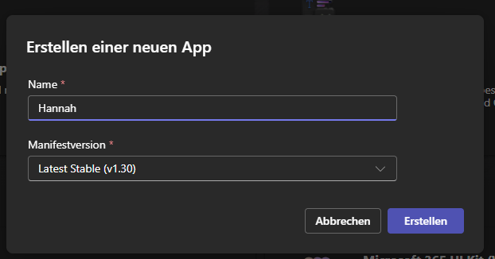
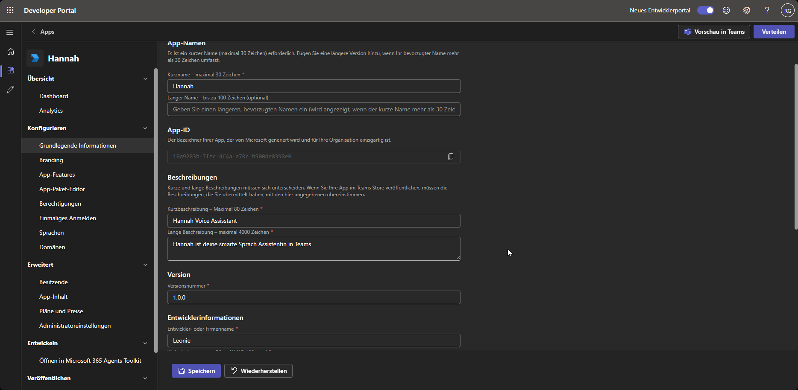
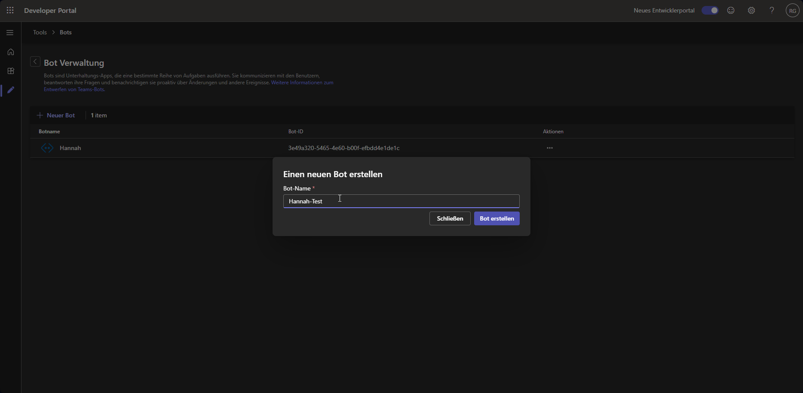
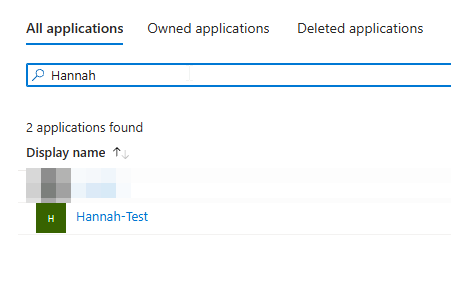
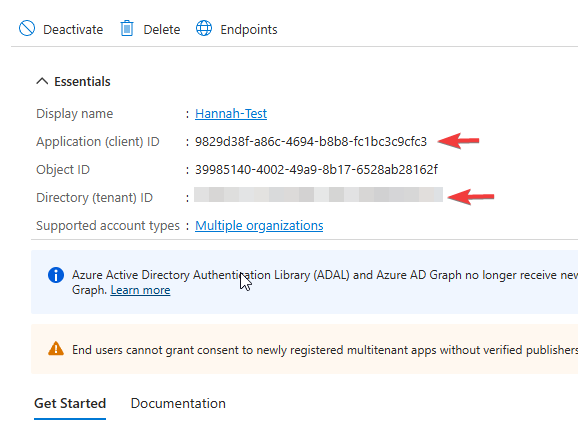
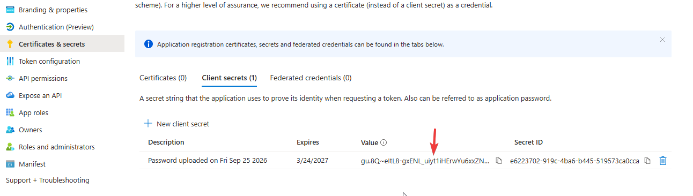
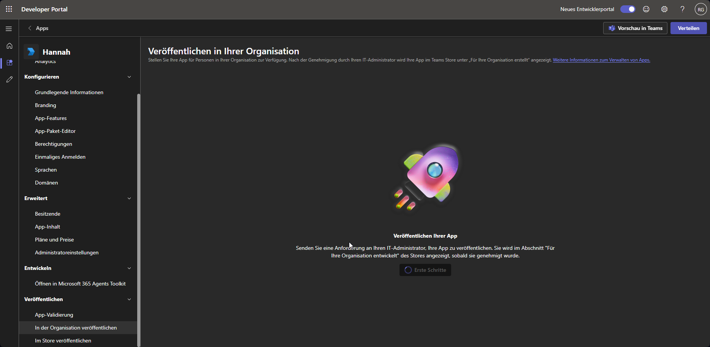
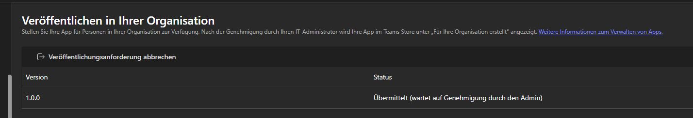

# Installation

Die Teams-Bridge gibt es nur als Docker-Image (`quay.io/m1kad0/hannah-msteams`) — kein
natives `install.sh`. Sie ist bewusst **nicht** Teil der
[Haupt-Compose-Datei](../../manual/installation.md): Sie muss aus dem Internet erreichbar
sein und gehört deshalb nicht auf denselben Host wie Hannah Core (siehe
[Sicherheit](#sicherheit)).

## Voraussetzungen

- **Öffentliche HTTPS-Adresse** — ein Reverse Proxy mit gültigem Zertifikat vor dem
  Container. Microsoft akzeptiert hier kein selbstsigniertes Zertifikat.
- **Verknüpfte Konten** — die Bridge ordnet eine Teams-Nachricht über die
  Microsoft-Objekt-ID einem Hannah-Nutzer zu. Das klappt nur für Nutzer, die ihr
  Microsoft-Konto in der WebUI verknüpft haben, siehe
  [Microsoft-Entra-Verknüpfung](../webui/entra-login.md).
- **Admin-Rechte in deinem Microsoft-Tenant** — für die Freigabe der App in Schritt 5.

## Teams-App einrichten

Einmalige Arbeit im [Teams Developer Portal](https://dev.teams.microsoft.com) und im
[Microsoft Entra Admin Center](https://entra.microsoft.com).

### 1. App anlegen

Im Developer Portal unter **Apps** → "Neue App": Name frei wählbar (z. B. "Hannah"),
Manifestversion auf "Latest Stable" lassen.



Unter **Grundlegende Informationen** die Pflichtfelder ausfüllen (Kurzname,
Beschreibungen, Entwicklername, …) und speichern.



### 2. Bot anlegen

Unter **Tools** → **Bot-Verwaltung** → "Neuer Bot".



Beim Bot unter **Konfigurieren** als
**Endpunktadresse** eintragen:

```text
https://deine-adresse/api/messages
```

Der Pfad `/api/messages` gehört mit dazu — ohne ihn kommen die Nachrichten nicht bei der
Bridge an.

### 3. Werte aus Entra ID holen

Das Developer Portal legt für den Bot automatisch eine App-Registrierung in Entra ID an.
Im Entra Admin Center unter **App-Registrierungen** → "Alle Anwendungen" den Bot-Namen
suchen.



Auf der **Übersicht**:

| Wert in Entra | Variable |
|---|---|
| Anwendungs-ID (Client) | `CLIENT_ID` |
| Verzeichnis-ID (Mandant) | `TENANT_ID` |



Unter **Zertifikate & Geheimnisse** → "Geheime Clientschlüssel" ein neues Secret anlegen
und direkt den **Wert** (nicht die Geheimnis-ID) kopieren — Microsoft zeigt ihn nur
dieses eine Mal an. Das ist `CLIENT_SECRET`.



Die Registrierung steht auf "Mehrere Organisationen" — das ist so gewollt und kein
Problem: Die Bridge verwirft Nachrichten aus fremden Tenants selbst.

!!! note "Ablaufdatum im Blick behalten"
    Ein Client-Secret läuft nach der gewählten Laufzeit ab. Danach kann die Bridge keine
    Antworten mehr an Teams schicken, bis du ein neues Secret angelegt und im Container
    eingetragen hast.

### 4. In der Organisation veröffentlichen

Zurück im Developer Portal, bei der App unter **Veröffentlichen** → "In der Organisation
veröffentlichen" → "Erste Schritte".



Der Status steht danach auf "Übermittelt (wartet auf Genehmigung durch den Admin)".



### 5. Als Admin genehmigen

Im [Teams Admin Center](https://admin.teams.microsoft.com) die App freigeben. Danach
finden Nutzer deines Tenants Hannah in Teams unter **Apps** → "Für Ihre Organisation
erstellt".

## Container starten

```bash
docker run -d \
  --name hannah-msteams \
  --restart unless-stopped \
  -p 127.0.0.1:3978:3978 \
  -e CLIENT_ID="Anwendungs-ID des Bots" \
  -e CLIENT_SECRET="Client-Secret des Bots" \
  -e TENANT_ID="Verzeichnis-ID (Mandant)" \
  -e HANNAH_GRPC_TARGET="10.0.0.10:50051" \
  quay.io/m1kad0/hannah-msteams:latest
```

Oder als eigene `docker-compose.yml`:

```yaml
services:
  hannah-msteams:
    image: quay.io/m1kad0/hannah-msteams:latest
    container_name: hannah-msteams
    restart: unless-stopped
    ports:
      - "127.0.0.1:3978:3978"
    environment:
      CLIENT_ID: "Anwendungs-ID des Bots"
      CLIENT_SECRET: "Client-Secret des Bots"
      TENANT_ID: "Verzeichnis-ID (Mandant)"
      HANNAH_GRPC_TARGET: "10.0.0.10:50051"
```

Port `3978` ist hier nur lokal erreichbar — der Reverse Proxy auf demselben Host leitet
`https://deine-adresse/api/messages` dorthin weiter. Einen persistenten Zustand hat die
Bridge nicht, ein Volume ist nicht nötig.

### Beispiel: hinter Traefik

Läuft [Traefik](https://traefik.io) als Reverse Proxy im selben Docker-Host, braucht der
Container gar keinen veröffentlichten Port. Die Route lässt nur genau den Pfad
`/api/messages` durch, alles andere auf der Adresse beantwortet Traefik selbst mit 404:

```yaml
services:
  hannah-msteams:
    image: quay.io/m1kad0/hannah-msteams:latest
    container_name: hannah-msteams
    restart: unless-stopped
    env_file:
      - msteams.env   # CLIENT_ID, CLIENT_SECRET, TENANT_ID, HANNAH_GRPC_TARGET
    networks:
      - traefik-public   # Traefik erreicht den Container
      - default          # Weg nach draußen: zu Core und zu Microsoft
    labels:
      - "traefik.enable=true"
      - "traefik.http.routers.hannah-msteams.rule=Host(`teams.example.com`) && Path(`/api/messages`)"
      - "traefik.http.routers.hannah-msteams.entrypoints=websecure"
      - "traefik.http.routers.hannah-msteams.tls=true"
      - "traefik.http.routers.hannah-msteams.tls.certresolver=letsencrypt"
      - "traefik.http.services.hannah-msteams.loadbalancer.server.port=3978"
      - "traefik.docker.network=traefik-public"

networks:
  traefik-public:
    external: true
```

`traefik-public`, `websecure` und `letsencrypt` sind Namen aus deiner eigenen
Traefik-Konfiguration — passe sie entsprechend an. Das `default`-Netz nicht weglassen:
Sobald `networks:` gesetzt ist, verbindet Docker den Container nur noch mit den dort
genannten Netzen — ist das Traefik-Netz als internes Netz ohne Routing angelegt, kommt
die Bridge sonst weder zu Core noch zu Microsoft durch. Die Secrets in einer eigenen
`env_file` statt direkt in der Compose-Datei zu halten, erspart dir, sie versehentlich
mit einzuchecken oder weiterzugeben.

## Konfiguration

Reine Umgebungsvariablen, keine Config-Datei. Fehlt einer der Pflichtwerte, beendet sich
der Container direkt mit einer Fehlermeldung.

| Variable | Zweck | Default |
|---|---|---|
| `CLIENT_ID` | Anwendungs-ID (Client) der Bot-Registrierung | — (erforderlich) |
| `CLIENT_SECRET` | Client-Secret der Bot-Registrierung | — (erforderlich) |
| `TENANT_ID` | Verzeichnis-ID (Mandant). Nachrichten aus anderen Tenants werden verworfen | — (erforderlich) |
| `HANNAH_GRPC_TARGET` | `host:port` von Hannah Cores gRPC-Server | — (erforderlich) |
| `PORT` | Port, auf dem die Bridge Nachrichten von Microsoft annimmt | `3978` |

Läuft ein [LogCollector](../logcollector/index.md), schickt die Bridge ihre Logs
automatisch dorthin — ohne weitere Einstellung. Das Client-Secret wird dabei maskiert.

## Sicherheit

Die Bridge ist die einzige Hannah-Komponente, die Verbindungen aus dem Internet annimmt.
Eingehende Nachrichten prüft sie selbst: Nur von Microsoft signierte Anfragen aus deinem
eigenen Tenant, von Nutzern mit verknüpftem Konto, landen überhaupt bei Hannah. Trotzdem
ist sie die exponierteste Stelle deines Setups — plane den Betrieb entsprechend.

### Mindestens

- **Nicht auf dem Host, auf dem Core läuft.** Ein eigener Rechner, eine eigene VM oder
  ein gemieteter Server.
- **Nach außen nur HTTPS auf `/api/messages`**, über einen Reverse Proxy (siehe
  [Traefik-Beispiel](#beispiel-hinter-traefik)). Port `3978` selbst nicht direkt ins
  Internet freigeben.
- **Core ist niemals aus dem Internet erreichbar.** Port `50051` gehört nicht in eine
  Portfreigabe.
- **Vom Bridge-Host ins Heimnetz nur genau eine Verbindung:** zu Core auf Port `50051`,
  sonst nichts. Die Verbindung ist aktuell unverschlüsselt — läuft die Bridge außerhalb
  deines Heimnetzes, gehört sie in einen VPN-Tunnel.

### Empfohlen

- Die Bridge in einem eigenen Netzsegment (DMZ) oder auf einem Server außerhalb deines
  Heimnetzes betreiben, der per VPN angebunden ist.
- Wenn vorhanden: eine Web Application Firewall vor dem Reverse Proxy.

!!! warning "Restrisiko"
    Wer die Bridge übernimmt, kann über ihre Verbindung zu Core alles, was Core per gRPC
    anbietet — nicht nur Nachrichten schicken, sondern zum Beispiel auch Geräte schalten.
    Eine Beschränkung der Bridge auf einzelne Funktionen gibt es derzeit nicht. Behalte
    deshalb Hannahs Aktivitätsverlauf im Blick und schalte die Bridge ab, wenn dir
    Aktionen auffallen, die niemand ausgelöst hat.
