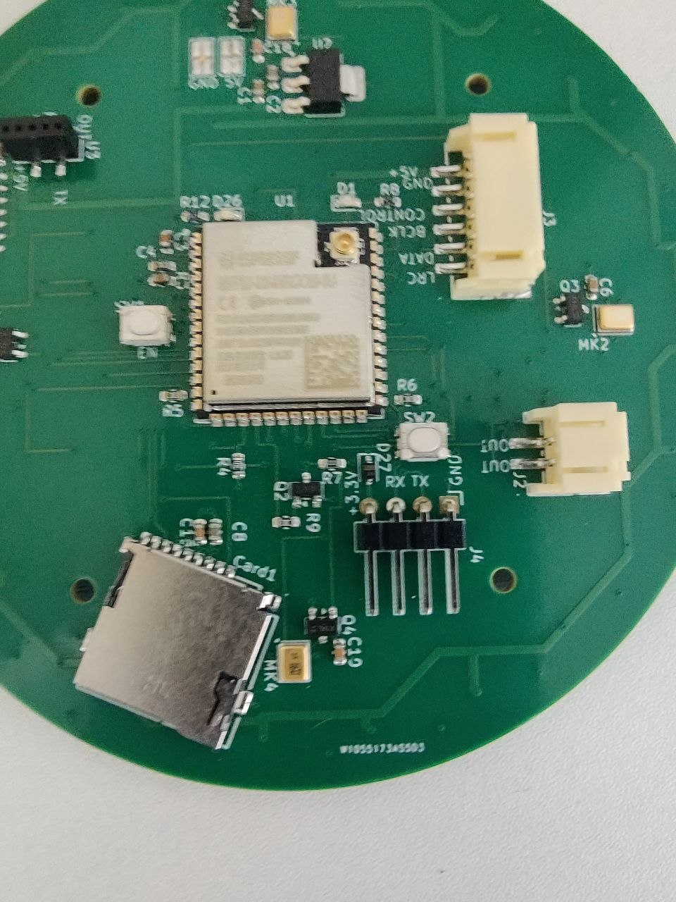
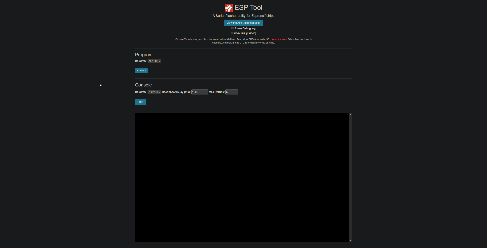
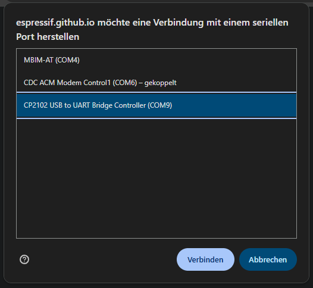
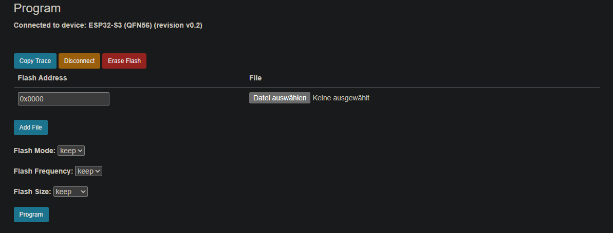

# Inbetriebnahme

Diese Seite beschreibt die Anschlüsse der Satelliten-Platine (Revision 5) und wie du
einen neuen Satelliten das erste Mal mit Firmware bespielst. Wie du die Platine bekommst,
steht unter [Platine bestellen](pcb-order.md).

## Anschlüsse im Überblick

Alle Anschlüsse liegen auf der Unterseite der Platine, auf der auch das ESP32-Modul sitzt.

| Anschluss | Wofür |
|---|---|
| **5V / GND** (Lötflächen) | Stromversorgung per USB-Kabel, siehe [USB-Kabel anlöten](pcb-order.md#usb-kabel-anloten) |
| **J4** (4-polig: +3.3V, RX, TX, GND) | Serielle Schnittstelle, nur für den ersten Flash nötig |
| **J2** | Lautsprecher (2-polig, PH2.0) |
| **J3** (6-polig) | Optionaler externer Verstärker, siehe [unten](#externer-verstarker-j3) |
| **U3** | Steckplatz für den Präsenz-Radar LD2410, wird von der Firmware noch nicht genutzt |
| **SW1** (EN) / **SW2** (GPIO0), Taster | Neustart (SW1) und GPIO0 (SW2), für den Download-Modus beim Flashen |

## Erster Flash

Ein neuer Satellit hat noch keine Firmware. Der erste Flash läuft **immer über die
serielle Schnittstelle J4**. Die Platine hat keinen USB-Anschluss für Daten, das
angelötete USB-Kabel dient nur der Stromversorgung. Alle späteren Updates kommen
kabellos per OTA über den [Update-Server](../update-server/index.md).

### Was du brauchst

- einen **USB-UART-Wandler** mit 3,3-V-Pegel, z. B.
  [diesen hier](https://www.amazon.de/dp/B0BN3MRQXF)
- den [Satellite Manager im ioBroker-Adapter](../iobroker-adapter/usage.md#satellite-manager)
  zum Erzeugen des Images
- **Chrome oder Edge** für den Web-Flasher (WebSerial)

!!! danger "Nie gleichzeitig USB-Strom und UART anschließen"
    Während des Flashens wird der Satellit über den UART-Wandler versorgt. Das
    angelötete USB-Stromkabel darf dabei **nicht** eingesteckt sein.

    **3,3 V sind Pflicht.** Auf J4 sitzt kein Spannungswandler: Was dort ankommt, geht
    direkt an das ESP32-Modul. 5 V zerstören es. Nutze bei deinem Wandler ausschließlich
    den 3,3-V-Anschluss bzw. -Modus. Je nach Modell wird das per Jumper eingestellt oder
    über einen eigenen Pin abgegriffen, beim oben verlinkten Wandler über die Wahl der
    Pins.

### UART-Wandler anschließen

| Wandler | J4 auf der Platine |
|---|---|
| 3.3V / VCC | +3.3V |
| GND | GND |
| TX | **RX** |
| RX | **TX** |

TX und RX werden gekreuzt: Was der Wandler sendet (TX), empfängt der Satellit (RX), und
umgekehrt.

Halte die Kabel zwischen Wandler und J4 kurz, etwa 20 cm reichen. Auf der 3,3-V-Leitung
sitzt eine Schutzdiode (D27), die verhindert, dass im Betrieb Spannung zurück in den
Wandler fließt. Sie kostet aber etwa 0,3 V. Lange oder dünne Kabel ziehen die Spannung
zusätzlich nach unten.

!!! tip "Flash bricht ab oder der ESP32 startet neu?"
    Meist ist die Spannung dann zu knapp. Nimm kürzere Kabel oder einen anderen
    USB-Port bzw. ein anderes USB-Kabel am Wandler.

### Download-Modus aktivieren

Damit der ESP32 neue Firmware annimmt, muss er im Download-Modus starten:

1. Taster **SW2** (GPIO0) gedrückt halten.
2. Taster **SW1** (EN) kurz drücken und wieder loslassen.
3. **SW2** loslassen.

Der ESP32 wartet jetzt auf die Firmware.

### Image erzeugen

Im [Satellite Manager](../iobroker-adapter/usage.md#satellite-manager) des
ioBroker-Adapters auf **Flash new satellite** klicken, Gerätename, Raum und Zugangsdaten
eintragen und dann **Download image** wählen. Du bekommst eine Datei
`hannah-satellite-<gerätename>.bin`. Sie enthält die Firmware und alle Einstellungen,
und der Satellit ist damit bereits bei Hannah angemeldet.

!!! note "Ein Image pro Satellit"
    Das Image gehört fest zu dem Gerätenamen, den du eingetragen hast. Für jeden weiteren
    Satelliten erzeugst du ein eigenes Image.

### Flashen

Das Image spielst du mit dem Web-Flasher von Espressif auf:
[espressif.github.io/esptool-js](https://espressif.github.io/esptool-js/)

1. Seite in **Chrome oder Edge** öffnen. Im Abschnitt **Program** die Baudrate auf
   `921600` lassen, *WebUSB (CH340)* nicht anhaken, und auf **Connect** klicken. Dann
   den COM-Port deines UART-Wandlers auswählen (der Name hängt vom Wandler ab, z. B.
   *CP2102 USB to UART Bridge Controller*).
2. Nach dem Verbinden erscheint eine Zeile mit **Flash Address** und **File**. Die
   Adresse ist mit `0x1000` vorbelegt, **ändere sie auf `0x0000`**, und wähle die
   heruntergeladene `.bin`-Datei aus. *Flash Mode*, *Flash Frequency* und *Flash Size*
   bleiben auf `keep`.
3. Auf **Program** klicken und warten, bis der Vorgang abgeschlossen ist.

Bricht das Verbinden oder Flashen ab, versuch es mit einer niedrigeren Baudrate, z. B.
`115200`. Das dauert länger, ist aber bei knapper Spannung oder längeren Kabeln
zuverlässiger.

??? info "Direkt aus ioBroker flashen"
    Der Satellite Manager kann auch direkt flashen (Button neben **Download image**),
    ohne Umweg über eine Datei. Dafür braucht der Browser aber WebSerial, und das
    funktioniert nur, wenn ioBroker Admin per **HTTPS** oder über `http://localhost`
    aufgerufen wird. Bei einem normalen `http://<ip>:8081` steht WebSerial nicht zur
    Verfügung.

Nach dem Flash:

1. UART-Wandler abziehen.
2. USB-Stromkabel einstecken.

Der Satellit startet mit der neuen Firmware und meldet sich bei Hannah an.

## Externer Verstärker (J3)

Standardmäßig treibt der eingebaute Verstärker (MAX98357A) den Lautsprecher an J2. An
J3 kannst du stattdessen einen externen I2S-Verstärker anschließen, zum Beispiel für
mehr Leistung oder einen Klinkenausgang. Die 5 V an Pin 6 sind separat mit 1 A
abgesichert, der externe Verstärker hat also seine eigene Versorgung.

Die Firmware gibt an J3 denselben Audiostream aus wie an den internen Verstärker:
**16 kHz, 16 Bit, mono**. Ein externer Verstärker kann daraus zwar ein Stereosignal
machen (beide Kanäle gleich), echtes Stereo liefert Hannah aber nicht.

| Pin | Signal | Bedeutung |
|---|---|---|
| 1 | AMP_LRC | Links/Rechts-Takt (Word Select) |
| 2 | AMP_DIN | Audiodaten |
| 3 | AMP_BCLK | Bit-Takt |
| 4 | CONTROL | Schaltet den internen Verstärker ab, wenn mit GND verbunden |
| 5 | GND | Masse |
| 6 | +5V | Versorgung für den externen Verstärker |

!!! note "Internen Verstärker abschalten"
    Der externe Verstärker muss **Pin 4 (CONTROL) mit Pin 5 (GND) verbinden**. Dadurch
    wird der interne Verstärker deaktiviert, und nur der externe gibt Ton aus.
