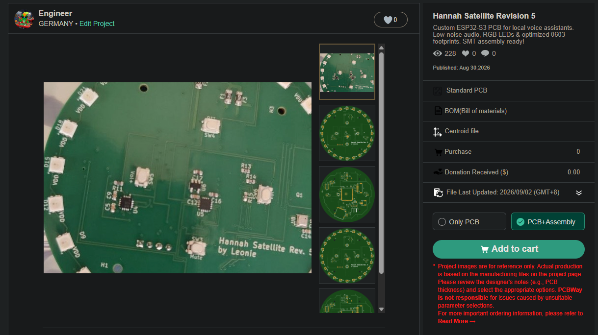
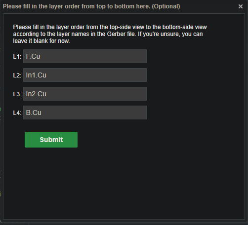
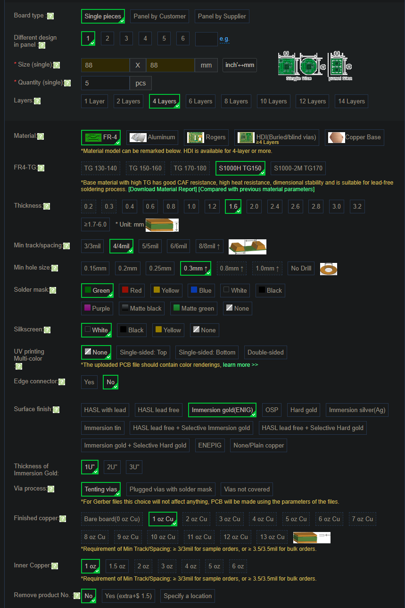
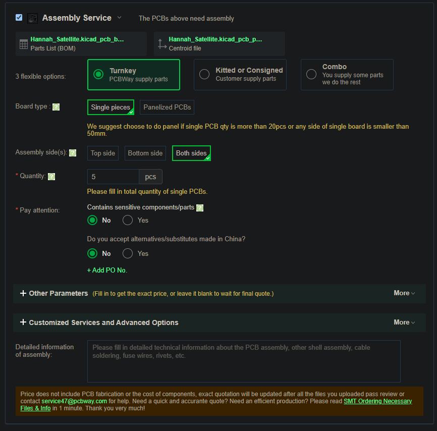
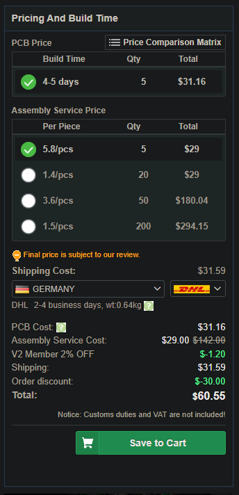
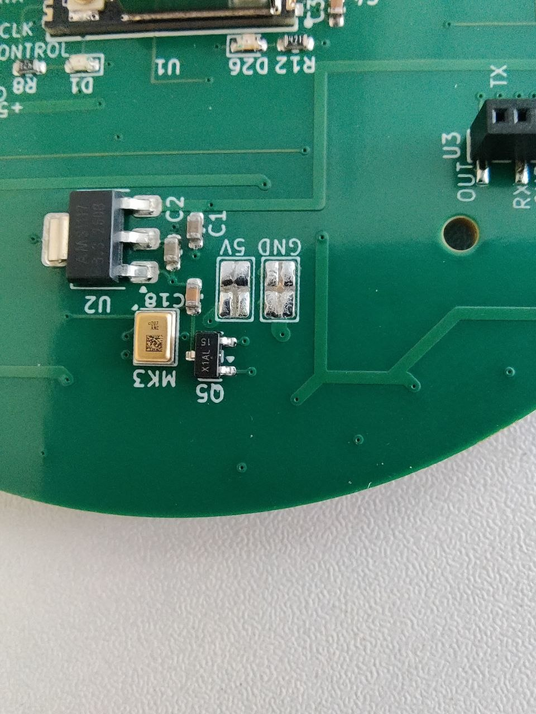

# Platine bestellen (PCBWay)

Die Satelliten-Platine (Revision 5) liegt als **Shared Project** bei PCBWay. Du bestellst
sie dort fertig bestückt: PCBWay fertigt die Platine, besorgt die Bauteile und lötet sie
auf. Gerber-Daten, Stückliste (BOM) und Bestückungsdaten sind im Projekt hinterlegt, du
musst nichts hochladen.

**Projekt:** [Hannah Satellite Revision 5 bei PCBWay](https://www.pcbway.com/project/shareproject/Hannah_Satellite_Revsion_5_676db7ad.html)

!!! info "Kosten und Menge"
    Die Mindestmenge liegt bei **5 Stück**. Rechne für 5 bestückte Platinen mit etwa
    **290–320 $ Endpreis**, also rund **50–55 € pro Platine** (Stand: Juli 2026). Der
    genaue Preis hängt von Bauteilpreisen, Oberfläche, Rabatten und Versand ab und steht
    erst nach der Prüfung durch PCBWay fest. PCBWay weist darauf hin, dass Zoll und
    Einfuhrumsatzsteuer nicht im angezeigten Preis enthalten sind.

## 1. Projekt in den Warenkorb legen

Öffne das Projekt, wähle rechts **PCB+Assembly** und klicke auf **Add to cart**.

## 2. Lagen-Reihenfolge angeben

PCBWay fragt direkt danach nach der Reihenfolge der Kupferlagen. Das Feld ist optional,
füllst du es aus, gibt es aber später keine Rückfrage. Trag die Lagen wie im Screenshot
ein und klicke auf **Submit**.

## 3. Platinen-Optionen

Die Bestellseite ist bereits aus dem Projekt vorausgefüllt (88 × 88 mm, 4 Lagen, 1,6 mm,
FR-4). Du kannst alles so lassen, wie es ist.

!!! tip "Optional: ENIG statt HASL"
    Unter **Surface finish** ist *HASL lead free* vorausgewählt. Das funktioniert. Wenn
    du **Immersion gold (ENIG)** wählst (*Thickness of Immersion Gold* bleibt auf
    **1U"**), zahlst du etwas mehr, bekommst aber zwei Vorteile:

    - **Ebenere Lötflächen:** Bei HASL wird das Lot auf die Flächen aufgeschmolzen und
      bleibt leicht gewölbt. ENIG ist eine hauchdünne, flache Goldschicht. Das hilft den
      sehr kleinen Bauteilen ohne Beinchen (z. B. dem Mikrofon-Wandler ADAU7118 und dem
      Verstärker MAX98357A), die nur mit ihrer Unterseite aufliegen: Sie werden
      zuverlässiger verlötet.
    - **Länger lagerfähig:** Die Goldschicht schützt das Kupfer gut vor Oxidation. Das
      ist vor allem interessant, wenn du Platinen auf Vorrat bestellst.

## 4. Bestückung (Assembly Service)

Weiter unten folgt der Abschnitt **Assembly Service**. Stückliste und Bestückungsdatei
sind schon verknüpft. Stelle Folgendes ein:

| Option | Einstellung | Warum |
|---|---|---|
| 3 flexible options | **Turnkey** | PCBWay besorgt alle Bauteile |
| Board type | **Single pieces** | Nutzen (Panels) lohnen sich erst ab größeren Stückzahlen |
| Assembly side(s) | **Both sides** | Die Platine ist auf beiden Seiten bestückt |
| Quantity | **5** | Gleiche Stückzahl wie oben bei der Platine |
| Contains sensitive components/parts | **No** | |
| Do you accept alternatives/substitutes made in China? | **No** | Es werden genau die Bauteile aus der Stückliste verbaut |

Die übrigen Felder (*Other Parameters*, *Customized Services*, *Detailed information*)
bleiben leer.

## 5. Preis berechnen und in den Warenkorb

Rechts in der Spalte **Pricing And Build Time** wählst du dein Land und die Versandart,
dann **Save to Cart**.

Der angezeigte Preis enthält die Platine, die Bestückung und den Versand, aber noch nicht
die Bauteile. Rabatte (z. B. *Member*- oder *Order discount*) hängen von deinem
PCBWay-Konto ab und können bei dir anders aussehen.

## 6. Prüfung und Bezahlung

Nach **Save to Cart** prüft PCBWay die Bestellung: Fertigungsdaten, Stückliste und
Verfügbarkeit der Bauteile. Erst danach steht der Endpreis inklusive Bauteile fest, und
du kannst die Bestellung im Warenkorb bezahlen. Bis dahin ist noch nichts bezahlt.

!!! note "Rückfragen von PCBWay"
    Findet PCBWay bei der Prüfung Unstimmigkeiten in den Projektdaten, zum Beispiel in
    der Stückliste, wenden sie sich direkt an die Entwicklerin des Projekts. Darum musst
    du dich nicht kümmern.

    Hast du trotzdem Fragen oder Probleme mit deiner Bestellung, melde dich gern im
    [Hannah-Thread im ioBroker-Forum](https://forum.iobroker.net/topic/84378/hannah-open-source-smart-home-sprachassistentin)
    oder per [Issue auf GitHub](https://github.com/NurPech/hannah/issues).

## Was du zusätzlich brauchst

Diese Teile sind **nicht** auf der Platine und müssen separat besorgt werden. Die Links
sind Beispiele, die im Einsatz sind:

| Teil | Hinweis | Beispiel |
|---|---|---|
| U.FL-Antenne | Das ESP32-S3-WROOM-1U hat keine eingebaute Antenne, ohne externe Antenne kein WLAN | [Amazon](https://www.amazon.de/dp/B0816W5DLP) |
| Lautsprecher | Dayton Audio RS75-4 (4 Ω) | [Soundimports](https://www.soundimports.eu/de/dayton-audio-rs75-4.html) |
| Lautsprecherkabel | **2-polig, Stecker PH2.0** — andere Stecker passen nicht | [AliExpress](https://de.aliexpress.com/item/1005009087160808.html) |
| USB-Kabel | Zur Stromversorgung, wird an die Platine gelötet (siehe unten) | [Amazon](https://www.amazon.de/dp/B0CDC1X4BY) |

## USB-Kabel anlöten

Die Platine hat keine USB-Buchse. Das USB-Kabel wird stattdessen an zwei Lötflächen
auf der Unterseite gelötet, die Beschriftung zeigt, welcher Draht wohin gehört:

- **5V:** Plus-Leitung des Kabels
- **GND:** Masse-Leitung des Kabels

Hat dein Kabel weitere Adern (z. B. Datenleitungen), werden sie nicht angeschlossen. Isoliere
sie einzeln, damit sie nichts berühren.

Die Lötflächen sind groß, das klappt auch ohne viel Löterfahrung.

!!! warning "Kabel von innen zuführen"
    Führe das Kabel **von der Seite des ESP32-Moduls** (also von der Platinenmitte her)
    an die Lötflächen, nicht vom Platinenrand. Im [Gehäuse](../../hardware/enclosure.md)
    läuft das Kabel durch ein Loch in der Mitte der Zwischendecke. Kommt es von außen an
    die Lötflächen, muss es beim Einbau umgebogen werden und kann dort knicken.

!!! tip "Tipp aus der Praxis"
    Nimm keine zu feine Spitze, eine gröbere ist hier besser. Spitze auf die Lötfläche
    halten, Lötzinn dazugeben, fertig.

    Temperatur: mit bleihaltigem Lot reichen etwa **250 °C**, mit bleifreiem eher
    **300–350 °C**. Die GND-Fläche hängt an einer großen Massefläche, die viel Wärme
    ableitet. Fließt das Lot nicht richtig, dreh die Temperatur etwas hoch.

    Ein Lötkolben mit **48 W** funktioniert erprobt gut. Halte die Spitze aber erst etwa
    10–20 Sekunden auf die Lötfläche, bis sie richtig warm ist, sonst schmilzt das Zinn
    nicht. Mit mehr Leistung geht es schneller. Schwache Lötkolben (z. B. 15–25 W) kommen
    gegen die Massefläche kaum an, auch wenn die eingestellte Temperatur stimmt.

## Wie geht es weiter?

- Gehäuse drucken: [Enclosure](../../hardware/enclosure.md)
- Anschlüsse und erster Flash: [Inbetriebnahme](commissioning.md)
- Satellit einrichten: [Konfiguration](configuration.md)
