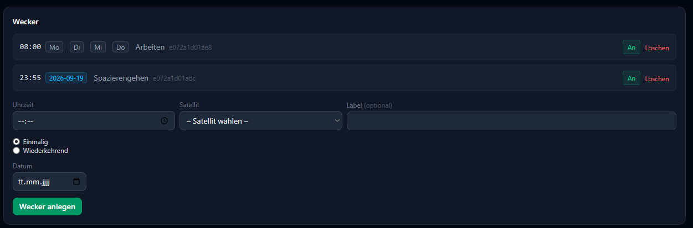

# Wecker

Anders als die meisten anderen Einstellungen ist ein Wecker **kein Admin-Thema** —
jeder Nutzer legt seine eigenen Wecker selbst an, auf seiner eigenen Profilseite
(**Mein Konto**). Es gibt keinen Trust-Level, der dafür nötig wäre.

## Anlegen

Im Abschnitt "Wecker" auf **Mein Konto**:

- **Uhrzeit** (Pflicht)
- **Satellit** (Pflicht) — der Satellit, auf dem der Wecker klingelt. Ein Wecker klingelt
  bewusst nicht überall im Haus gleichzeitig, deshalb ist ein Ziel-Satellit
  vorgeschrieben
- **Label** — optionaler freier Text, z. B. "Arbeit"
- **Einmalig** (mit Datum) oder **Wiederkehrend** (mit Wochentags-Auswahl)

Per Sprache geht das genauso: *"Stell mir einen Wecker auf 7 Uhr"*. Nennst du dabei nur
einen Wochentag (z. B. *"Wecker für Montag um 6 Uhr"*), fragt Hannah aktiv nach, ob
daraus gleich eine Mo–Fr-Serie werden soll, statt nur den einen Tag anzulegen.

## Verhalten beim Klingeln

- Die Lautstärke steigt langsam an (leise → laut), statt sofort voll loszulegen.
- Ein Wecker klingelt bewusst auch bei aktivem "Nicht stören" durch — er soll dich ja
  gerade wecken.
- Läuft der Satellit gerade eine Sprachaufnahme fürs Wake-Word-Training auf, pausiert
  das Klingeln automatisch, damit es die Aufnahme nicht stört, und läuft danach normal
  weiter.
- Spielt der Klingelton aus irgendeinem Grund nicht ab, weicht Hannah automatisch auf
  eine gesprochene Ansage aus, statt stumm zu bleiben.

Ein einmaliger Wecker löscht sich nach dem Klingeln selbst; ein wiederkehrender
plant automatisch seinen nächsten Termin.

## Stoppen und Verwalten

Sag einfach *"Stopp"*, um einen klingelnden Wecker zu beenden. Über *"Zeig mir meine
Wecker"* listet Hannah alle bestehenden auf; per Sprache lassen sich Wecker auch wieder
löschen (bzw. bei einer Serie nur ein einzelner Tag überspringen).

### Wichtig: kein Trust-Level-Schutz

Anders als man erwarten könnte, ist das **Löschen/Deaktivieren fremder Wecker per
Sprache nicht eingeschränkt**: wer einen Satelliten im Haus anspricht und Datum bzw.
Uhrzeit eines Weckers trifft, kann diesen Wecker beenden oder für diesen Tag aussetzen —
unabhängig davon, wem er gehört. Das ist bewusst so gebaut (jemand soll einen fremden,
störenden Wecker auch ohne Zugriff auf dessen Account abstellen können), sieht auf den
ersten Blick aber wie ein Berechtigungsproblem aus. Es gibt aktuell **kein**
Trust-Level-Gate dafür — das ist als [Known Gap](known-gaps.md#wecker-kein-trust-level-schutz-beim-löschen-fremder-wecker)
gelistet und soll langfristig eingeschränkt werden.

In der WebUI dagegen sieht und verwaltet jeder ausschließlich die eigenen Wecker auf
seiner eigenen "Mein Konto"-Seite.
