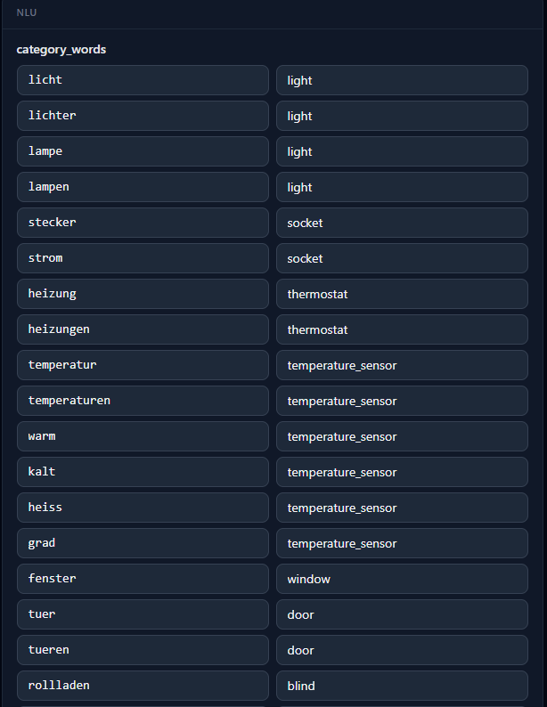
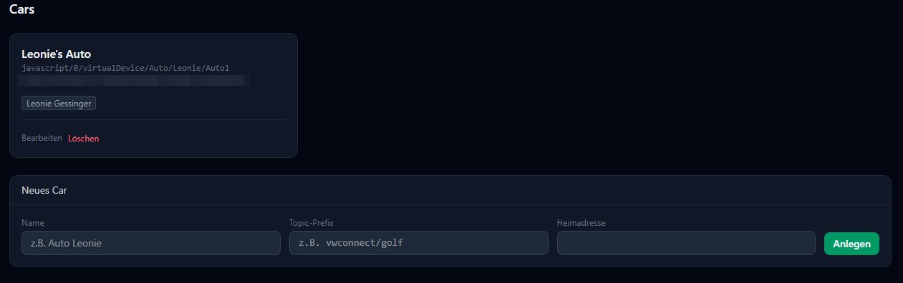

# Erweiterte Einstellungen

Core hat neben `config.yaml` (siehe [Core → Konfiguration](../components/core/configuration.md))
eine zweite Ebene an Einstellungen, die komplett in Cores eigener Datenbank liegt und
sich zur Laufzeit ändert — ausschließlich über die WebUI verwaltet. Alle Seiten hier
brauchen Trust-Level ≥ 10.

## NLU-Wortlisten

Unter **Einstellungen** → Kategorie **nlu** liegen die deutschen Wörter, die Hannahs
Sprachverständnis für bestimmte Aktionen erkennt — z. B. welche Wörter "anschalten"
bedeuten, welches Substantiv für welche Gerätekategorie steht, oder welche Wörter für
Klimaanlagen-Betriebsarten und Lüfterstufen stehen (siehe das Klimaanlagen-Beispiel auf
[Smart-Home-Integration](smart-home-integration.md#3-komplex-eine-klimaanlage)).

Jede Liste bearbeitest du direkt inline:

- **Wortlisten** (z. B. "Ein"-Wörter, "Aus"-Wörter, Rollladen auf/zu) erscheinen als eine
  Zeile pro Wort — neue Wörter über die leere Zeile am Ende hinzufügen, vorhandene
  löschen oder ändern.
- **Zuordnungen** (z. B. deutsches Substantiv → Gerätekategorie) erscheinen als
  Schlüssel/Wert-Tabelle mit zwei Eingabefeldern pro Zeile.

Änderungen wirken sofort, ohne Core-Neustart. Ist dir ein Wort zu speziell formuliert
oder fehlt eines ganz (z. B. ein Dialektausdruck), trägst du es einfach hier ein.

## LLM-System-Prompt

Ebenfalls unter **Einstellungen**, Kategorie **llm**: ein freier Text, der Hannahs
LLM-gestützten Antworten (Smalltalk, Umformulierung von Systemmeldungen) eine Persönlichkeit
gibt — z. B. *"Du bist Hannah. Deine Antworten werden per Sprachausgabe vorgelesen."*

Ist das Feld leer, antwortet das LLM ganz ohne zusätzlichen Persona-Zusatz. Der Prompt
wird bei jedem Gespräch automatisch um Kontext zur sprechenden Person ergänzt — u. a. ihr
Name und ihr [Trust-Level](users.md#trust-level) — das musst du hier nicht selbst
hinschreiben.

## Fahrzeuge

Unter **Fahrzeuge** verwaltest du Autos, die per MQTT (z. B. über eine VW-Connect-Anbindung)
ihren Status an Hannah melden:

- **Name** — wie das Fahrzeug angesprochen wird
- **Topic-Prefix** — das MQTT-Topic, unter dem das Fahrzeug seine Daten sendet (z. B.
  `vwconnect/golf`); muss eindeutig sein
- **Heimadresse** — Referenzpunkt, um z. B. zu erkennen, ob das Auto "zuhause" steht
- **Besitzer** — ein oder mehrere Nutzer, die dieses Fahrzeug per Mehrfachauswahl "besitzen"

Fragt jemand *"wo ist mein Auto"*, beantwortet Hannah das ausschließlich mit den
Fahrzeugen, die der sprechenden Person als Besitzer zugeordnet sind — nie mit fremden
Autos.

## Gruppen

Unter **Gruppen** legst du frei benannte **Sets aus Satelliten** an — z. B. "Oben" für
alle Satelliten im Obergeschoss, unabhängig davon, wie die einzelnen Räume heißen. Eine
Gruppe ist kein physischer Raum, sondern eine reine Ansage-/Automatisierungs-Abkürzung:
sag oder trigger auf "Oben", und alle zugeordneten Satelliten reagieren gemeinsam.

Beim Anlegen gibst du nur einen Namen an (die interne ID wird automatisch daraus
abgeleitet); danach wählst du auf der Bearbeiten-Seite per Checkbox-Liste, welche
Satelliten zur Gruppe gehören. Gruppen lassen sich überall dort als Ziel verwenden, wo
sonst ein Raum stünde — z. B. als Ansage-Ziel eines [Triggers](triggers.md).

## BLE-Tags

Unter **BLE-Tags** verwaltest du Bluetooth-Anhänger (z. B. am Schlüsselbund), die
Hannahs Satelliten per Signalstärke orten können:

- **MAC-Adresse** (Pflicht, eindeutig)
- **Label** — freier Anzeigename
- **Besitzer** — optional, der Nutzer, dem dieser Tag zugeordnet ist

Ein Tag muss keinem Nutzer gehören (z. B. für Test-Tags), erst mit zugeordnetem
Besitzer lässt er sich als [Presence-Quelle](users.md#presence-quellen-anwesenheit) für
diese Person eintragen — dort wählst du ihn dann per Dropdown statt eine State-ID von
Hand einzutippen.
