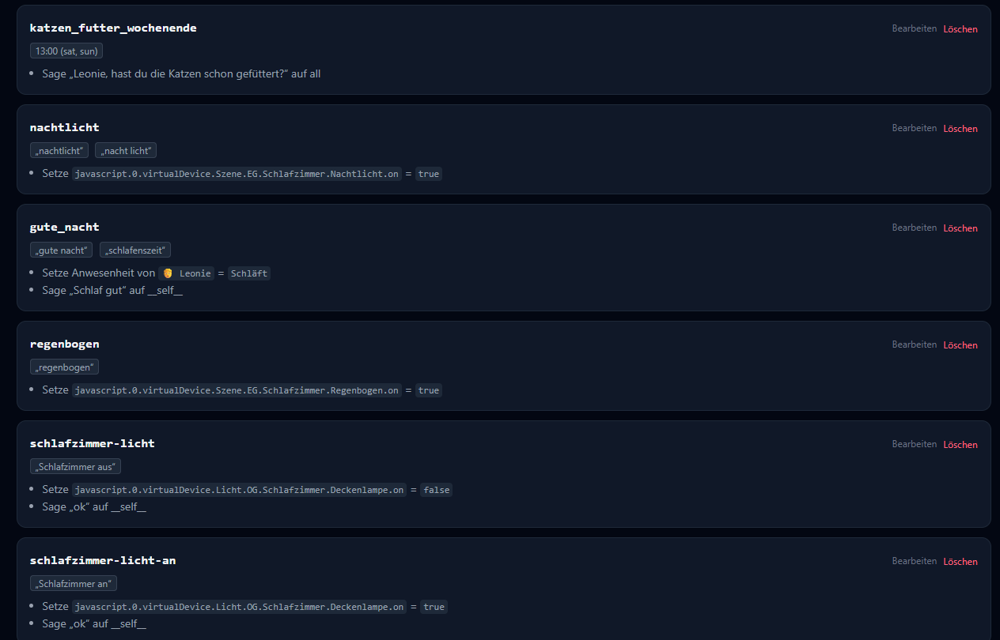
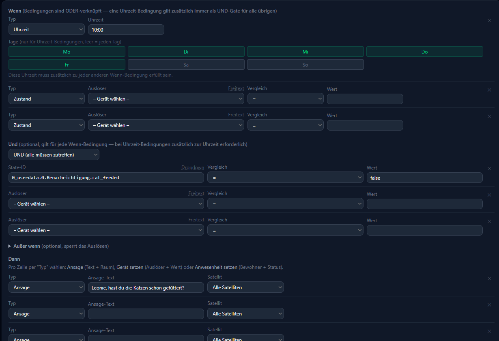

# Trigger

Ein Trigger ist eine **proaktive Automatisierung**: Hannah beobachtet selbstständig
ioBroker-Zustände, die Uhrzeit oder was gesagt wird — und führt bei einem Treffer
automatisch eine Aktion aus, ohne dass du danach fragen musst. Typisches Beispiel:
*"Wenn das Küchenfenster länger als 15 Minuten offen ist, sag mir Bescheid."*

Trigger ansehen braucht Trust-Level ≥ 5, anlegen/bearbeiten/löschen ≥ 7 (siehe
[Nutzerverwaltung → Trust-Level](users.md#trust-level)). Das vergleichsweise hohe Level
fürs Anlegen kommt daher, dass Trigger aktuell **global fürs ganze Haus** wirken, nicht
nur für die eigene Person — siehe [Known Gaps](known-gaps.md#trigger-global-statt-pro-nutzer).

## Wenn: die Bedingung

Jeder Trigger startet mit mindestens einer **Wenn**-Bedingung. Es gibt drei Typen, pro
Trigger frei kombinierbar (mehrere Wenn-Zeilen werden mit ODER verknüpft — außer einer
Uhrzeit-Zeile, die immer zusätzlich als UND-Filter über allem anderen wirkt):

| Typ | Beispiel | Details |
|---|---|---|
| **Zustand** | Fenster-State ist "offen" | Vergleich exakt, "größer als" oder "kleiner als" ein Wert |
| **Uhrzeit** | 22:00 Uhr, nur Mo–Fr | Optional auf bestimmte Wochentage eingeschränkt |
| **Phrase** | Enthält "gute nacht" | Reiner Text-Abgleich, **vor** der normalen Sprachverarbeitung geprüft — reagiert daher auch auf Formulierungen, die Hannah sonst nicht verstehen würde |

Phrase-Trigger haben kein Cooldown (siehe unten) — sie sollen jedes Mal reagieren, wenn
der Satz fällt.

### Und / Außer wenn

Zusätzlich zur Wenn-Bedingung lassen sich zwei weitere Bedingungsgruppen angeben:

- **Und** — zusätzliche Bedingung(en), die zum Zeitpunkt des Auslösens ebenfalls
  zutreffen müssen (z. B. "Fenster offen" **und** "niemand zuhause")
- **Außer wenn** (aufklappbar) — blockiert das Auslösen, solange diese Bedingung
  zutrifft (z. B. nicht ansagen, **solange** noch jemand im Raum ist)

## Dann: die Aktion

Pro Trigger sind mehrere Aktionen möglich:

- **Ansage** — Text, den Hannah vorliest, mit einem Ziel: ein bestimmter Raum, eine
  [Gruppe](settings.md#gruppen), alle Satelliten, oder **"Angesprochener Satellit"** —
  spielt die Ansage genau dort ab, wo der Trigger ausgelöst wurde (nur bei
  Phrase-Triggern sinnvoll, da nur die einen "auslösenden" Satelliten kennen)
- **Gerät setzen** — schreibt einen ioBroker-State (dieselbe Geräte-Auswahl wie auf der
  [Smart-Home-Integration](smart-home-integration.md)-Seite beschrieben)
- **Anwesenheit setzen** — setzt den Anwesenheitsstatus (zuhause/weg/schläft/wach) eines
  Bewohners direkt, z. B. als Teil einer "Gute Nacht"-Phrase

## Weitere Felder

- **Satellit/Ziel** — wie bei der Ansage-Aktion: Raum, Gruppe, alle, oder der
  auslösende Satellit
- **Cooldown** — Mindestabstand in Sekunden zwischen zwei Auslösungen desselben
  Triggers (Standard: eine Stunde) — verhindert, dass ein wackeliger Sensor Hannah im
  Minutentakt reden lässt
- **Delay** — statt sofort zu reagieren, wartet Hannah die angegebene Zeit ab (z. B.
  `5h`, `30m`) und prüft erst dann erneut. Eine erfüllte **Außer wenn**-Bedingung kann
  das verzögerte Auslösen in der Zwischenzeit noch abbrechen
- **LLM-Umformulierung** — lässt Hannah den Ansage-Text vor dem Vorlesen leicht
  umformulieren, statt ihn wortwörtlich vorzulesen

!!! note "Fortgeschritten: Frage + Antwortregeln"
    Ein Trigger kann statt einer Ansage auch eine **Frage** stellen und die Antwort
    gegen frei definierte Regeln auswerten (z. B. um je nach Antwort unterschiedlich zu
    reagieren). Das ist ein mächtiges, aber auch komplexes Feature für fortgeschrittene
    Automatisierungen — im Trigger-Editor unter "Erweitert" zu finden, hier bewusst nur
    kurz erwähnt.
