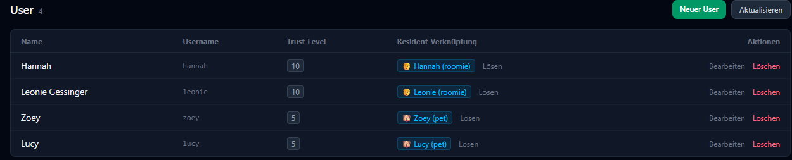
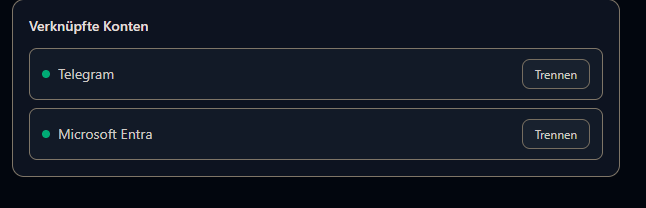

# Nutzerverwaltung

Jede Person, die mit Hannah spricht oder die WebUI benutzt, ist ein **Nutzer** — in der
WebUI und im Rest dieser Doku auch "Roomie" genannt. Nutzer regeln zwei Dinge: *wer darf
was* (Trust-Level) und *wer ist gerade zuhause* (Anwesenheit, siehe
[Presence-Quellen](#presence-quellen-anwesenheit)).

## Erster Login

Beim allerersten Start (leere Datenbank, noch kein Nutzer angelegt) legt Core automatisch
einen **Admin-Account** mit zufällig generiertem Passwort an — Benutzername `admin`,
Trust-Level 10. Beides wird **genau einmal** ins Core-Log geschrieben, danach nirgends
mehr angezeigt:

```text
=======================================================
  First-run: admin account created
  Username : admin
  Password : Xk3mZ9pQvR2tYbNc8dF1Lg
  Please change the password after first login!
=======================================================
```

Wo du das findest, hängt davon ab, wie Core läuft:

- **Docker**: `docker compose logs -f hannah-core` (oder `docker logs hannah-core`, falls
  der Container schon eine Weile läuft und du weiter zurückscrollen musst)
- **Native Installation**: `sudo journalctl -u hannah -f` — oder ohne `-f` durchsuchen,
  falls der Start schon länger zurückliegt

Mit diesem Login meldest du dich einmalig in der WebUI an und legst dir dort einen eigenen
Nutzer an (oder änderst direkt das Admin-Passwort, siehe
[Nutzer anlegen und bearbeiten](#nutzer-anlegen-und-bearbeiten) unten).

!!! warning "Passwort verpasst?"
    Ein zweites Mal wird die Meldung nicht ausgegeben — auch nicht bei einem Neustart,
    solange schon Nutzer in der Datenbank stehen. Findest du sie in deinem Log nicht mehr
    (z. B. weil er inzwischen rotiert wurde), bleibt nur der Weg über die Datenbank direkt
    auf dem Server, um einen neuen Admin anzulegen oder das Passwort zurückzusetzen.

## Trust-Level

Jeder Nutzer hat ein **Trust-Level von 0 bis 10**. Es ist keine Alters- oder
Rollenbezeichnung, sondern eine reine Zahl, die an genau zwei Stellen wirkt:

1. **Berechtigung** — viele Aktionen in der WebUI (und ein paar Sprachbefehle) sind erst
   ab einem bestimmten Trust-Level sichtbar bzw. ausführbar.
2. **Gesprächskontext** — Hannahs LLM bekommt das Trust-Level der sprechenden Person als
   Teil des System-Prompts mit (`Vertrauenslevel: X/10`). Es beeinflusst also potenziell
   auch, *wie* Hannah antwortet, nicht nur, was sie zulässt.

Neue Nutzer bekommen standardmäßig Trust-Level 5. Ändern kannst du das unter
**Nutzerverwaltung → Bearbeiten** (nur mit eigenem Trust-Level ≥ 10 sichtbar).

Die wichtigsten Schwellenwerte in der WebUI:

| Aktion | Ab Trust-Level |
|---|---|
| Räume sehen | 3 |
| Satelliten sehen (nur eigene, falls < 10) | 5 |
| Trigger ansehen | 5 |
| Eigenen Satelliten umbenennen/verschieben | 5 (nur eigene, außer schon ≥ 10) |
| Trigger anlegen/bearbeiten/löschen | 7 |
| Nutzer verwalten, Satelliten löschen/Besitzer ändern, Firmware-Updates anstoßen | 10 |
| Fahrzeuge, Gruppen, BLE-Tags, Core-Einstellungen (NLU/LLM-Prompt) verwalten | 10 |
| Voiceprint für eine **andere** Person aufnehmen | 10 |
| Aktivitätslog/Postfach einer **anderen** Person einsehen | 10 |
| Verknüpftes Konto einer **anderen** Person trennen | 10 |

!!! note "Wecker sind eine Ausnahme"
    [Wecker](alarms.md) sind bewusst **nicht** trust-gated — Details dazu auf der
    [Wecker-Seite](alarms.md#wichtig-kein-trust-level-schutz).

Für unbekannte oder nicht angemeldete Anfragen (z. B. Systemprozesse) gilt intern kein
Trust-Level-Check — das betrifft nur Hannah selbst, nicht reguläre Nutzer.

## Nutzer anlegen und bearbeiten

Unter **Nutzerverwaltung** (Trust-Level ≥ 10 nötig) legst du neue Nutzer an oder
bearbeitest bestehende:

- **Username, Anzeigename, E-Mail, Passwort** — Anzeigename ist optional und fällt sonst
  auf den Username zurück.
- **Typ**: `roomie` (echter Bewohner), `guest` (Gast) oder `pet` (Haustier — z. B. für
  eigene Presence-Quellen wie einen BLE-Tag am Halsband, ohne dass ein Tier als "Bewohner"
  zählt).
- **Trust-Level** (siehe oben).
- **Aktiv** — deaktivierte Nutzer verschwinden aus den meisten Listen und Auswahlfeldern,
  ohne dass ihre Daten gelöscht werden.
- **System-Benachrichtigungen** — ob diese Person wichtige/dringende Meldungen erhält
  (siehe "Hannah sagen" auf der [ioBroker-Adapter-Nutzungsseite](../components/iobroker-adapter/usage.md#blockly-blocke)).

Es gibt daneben noch einen internen, unsichtbaren **Mood-Level** — beeinflusst
Formulierungen, ist keine von dir zu pflegende Einstellung.



!!! warning "Löschen ist endgültig"
    Einen Nutzer zu löschen entfernt auch alle seine Wecker, verknüpften Konten und
    Presence-Quellen. Satelliten und BLE-Tags, die ihm gehörten, werden nicht gelöscht,
    verlieren aber ihren Besitzer (musst du danach neu zuweisen).

## Verknüpfte Konten

Ein Hannah-Nutzer kann mit externen Konten verknüpft werden. Das läuft an zwei
unterschiedlichen Stellen, je nachdem worum es geht:

- **Residents (ioBroker-Anwesenheit)** — wird admin-seitig auf der Nutzerliste
  verknüpft: pro Nutzer ein Dropdown mit den vom Residents-Adapter gemeldeten Personen +
  "Verknüpfen"-Button. Ein Resident taucht dort erst auf, sobald ioBroker mindestens
  einmal ein Anwesenheits-Update für ihn geschickt hat.
- **Telegram** und **Microsoft Entra** — laufen **nicht** über die Nutzerverwaltung,
  sondern **Self-Service**: jeder Nutzer verknüpft seine eigenen Konten selbst, auf seiner
  eigenen Profilseite (**Mein Konto** → "Verknüpfte Konten" → "Verbinden").



Ein externes Konto lässt sich immer nur mit **einem** Hannah-Nutzer verknüpfen. Sein
eigenes Konto trennt jeder selbst; ein fremdes zu trennen braucht Trust-Level ≥ 10.

### Telegram

Läuft die [Telegram-Komponente](../components/telegram/index.md), zeigt **Mein Konto**
bei Telegram einen "Verbinden"-Button. Ein Klick öffnet einen Link zum Hannah-Bot in
Telegram; dort drückst du auf **Start**, und der Bot bestätigt die Verknüpfung. **Mein
Konto** aktualisiert sich währenddessen von selbst, sobald die Verknüpfung steht.

Der Link gilt zehn Minuten und nur ein einziges Mal. Ist er abgelaufen, sagt dir der Bot
das — dann in der WebUI einfach noch einmal auf "Verbinden" klicken. Eine Domain, HTTPS
oder eigene Telegram-Einstellungen in der WebUI brauchst du dafür nicht.

!!! note "Kein Button zu sehen?"
    Dann ist die Telegram-Komponente gerade nicht mit Hannah verbunden — nicht
    installiert, gestoppt oder noch in einer älteren Version. Ohne laufenden Bot ergibt
    eine Verknüpfung ohnehin keinen Sinn, deshalb blendet die WebUI den Button in dem Fall
    bewusst aus.

    Als Rückfallebene kennt die WebUI noch das Telegram-Login-Widget. Das braucht
    allerdings Domain und HTTPS, siehe
    [Telegram-Verknüpfung einrichten](../components/webui/telegram-login.md).

### Microsoft Entra

Ist in der WebUI eine Microsoft-Entra-Anmeldung eingerichtet (siehe
[Microsoft-Entra-Verknüpfung einrichten](../components/webui/entra-login.md)), zeigt
**Mein Konto** bei "Microsoft Entra" einen "Verbinden"-Button. Ein Klick leitet zur
Microsoft-Anmeldung weiter; nach dem Login landest du wieder auf **Mein Konto**, und das
Konto ist verknüpft. Ist die Anmeldung nicht eingerichtet, steht dort statt des Buttons nur
ein Hinweis.

## Presence-Quellen (Anwesenheit)

Damit Hannah weiß, ob jemand zuhause, unterwegs oder schon eingeschlafen ist, wertet sie
pro Nutzer eine oder mehrere **Presence-Quellen** aus (**Nutzerverwaltung** → Nutzer
bearbeiten → "Presence-Quellen verwalten"). Jede Quelle hat:

- einen **Typ** (z. B. ein roher ioBroker-State, oder ein **BLE-Tag** — siehe
  [Erweiterte Einstellungen → BLE-Tags](settings.md#ble-tags))
- eine **Referenz** (die konkrete State-ID bzw. bei BLE-Tags eine Auswahl aus den
  Tags dieses Nutzers)
- eine **Home-** und **Away-Konfidenz** (0–1) — wie stark diese einzelne Quelle für
  "zuhause" bzw. "weg" spricht, falls sich mehrere Quellen widersprechen
- ob sie **aktiv** ist

Mehrere Quellen pro Nutzer sind der Normalfall (z. B. ioBroker-Präsenzmelder **und**
BLE-Tag) — Hannah kombiniert sie, statt sich auf eine einzelne Quelle zu verlassen.
